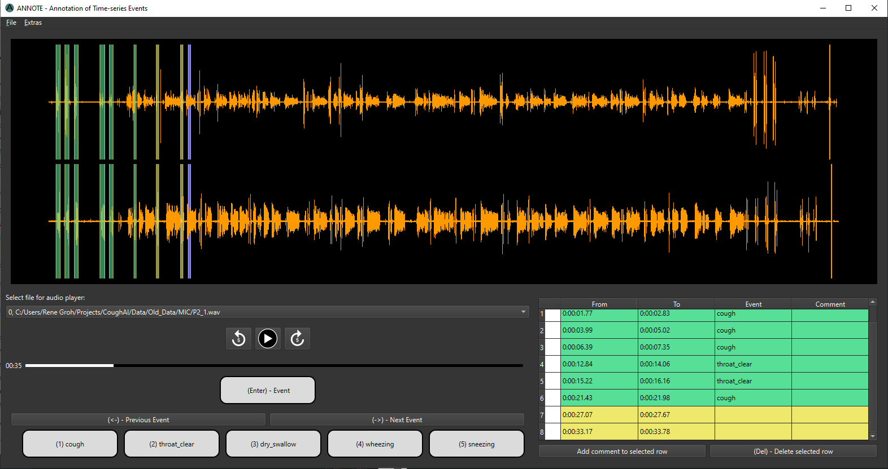

# ANNOTE

## Annotation of Time-series Events

Annotation of Time-series Events (ANNOTE) is a new annotation software. 
It enables the loading of 
longitudinal, time-series data from audio files or CSV 
files. It provides visualization of up to three 
one-dimensional data signals, such as audio or sensor data, 
allowing users to select regions to indicate event start 
and end points. Dynamic label adjustments adapt to user 
requirements, while the user-friendly nature of the 
software ensures accessibility for professionals and 
non-professionals alike. ANNOTE's streamlined annotation 
process accelerates the development of models and 
applications that rely on annotated time-series data.

# Highlights
- Load audio files or CSV files
- Visualize up to three one-dimensional data signals
- Annotate start and end points of events
- Dynamic label adjustments

# Demo
For a demo you can watch our youtube video 
where we demonstrate the use of ANNOTE.


# Contents
- [Quick Start](#quick-start)
- [Getting started](#getting-started)
- [Authors](#authors)
- [License](#license)
- [Citation](#citation)

## Quick Start
To get started with ANNOTE straight away, you can download 
the folder from [Google Drive](tbd). 
The folder contains the following files:

- annote.exe (Windows)
- ffmpeg.exe (Windows)
- annote_intel.app (MacOS)
- annote_m1_m2.app (MacOS)


## Getting started
We provide:
- a demo video on [YouTube](https://www.youtube.com/watch?v=)
- an example for a [labels file](labels_file_example.json)


### Install with pip

````
pip install git+https://github.com/ankilab/ANNOTE.git
````

### Build from source

````    
git clone https://github.com/ankilab/ANNOTE.git
cd ANNOTE
pip install -r requirements.txt
python main.py
````

## Authors
- René Groh ([rene.groh@fau.de](mailto:rene.groh@fau.de]))
- A
- B
- Nicole Y.K. Li-Jessen
- Andreas M. Kist 

## License
The project is licensed under the MIT License. See the [LICENSE](LICENSE) file for details.

## Citation
If you use ANNOTE in your research, please cite our paper:

```
@article{,
    title = {ANNOTE: Annotation of Time-series Events},
    journal = {},
    volume = {},
    pages = {},
    year = {2023},
    issn = {},
    doi = {},
    url = {},
    author = {Groh, René; Kist, Andreas M.},
    keywords = {}
}
```

